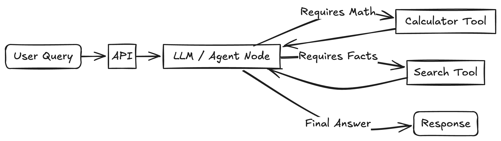

[<- Back to Main README](../../../README.md)

# LLM Simple Agent

This project is a simple demonstration of a tool-calling agent built with LangChain and FastAPI. The agent is capable of understanding user queries and routing them to the appropriate tool, either a calculator or a web search tool.



## Purpose
The main purpose of this project is to provide a simple and easy-to-understand example of a tool-calling agent. It demonstrates how to build an agent that can use external tools to answer questions and perform actions.

## Tech Stack

*   **[LangChain](https://python.langchain.com/v0.1/docs/get_started/introduction/)**: For building the agent and managing its control flow.
*   **[Ollama](https://ollama.ai/)**: For running the local LLM (e.g., Llama 3).
*   **[FastAPI](https://fastapi.tiangolo.com/)**: For serving the agent as a REST API.
*   **[Docker](https://www.docker.com/)**: For containerizing the application.

## Getting Started

### Prerequisites

*   [Docker](https://docs.docker.com/get-docker/) installed on your machine.
*   [Ollama](https://ollama.ai/) installed and running.

### Installation

1.  **Clone the repository:**

    ```bash
    git clone https://github.com/Prosen-Ghosh/llm_demo.git
    cd 60-day-bootcamp/day-16-37/llm-simple-agent
    ```

2.  **Pull the Ollama model:**

    ```bash
    ollama run gpt-oss:120b-cloud
    ```

3.  **Build and run the application:**

    ```bash
    docker-compose up --build
    ```

## Usage

Once the application is running, you can interact with the agent by sending POST requests to the `/ask` endpoint.

### Calculator

To perform a calculation, send a POST request with a JSON payload containing the query:

```bash
curl -X POST "http://localhost:8000/ask" -H "Content-Type: application/json" -d '{"query": "What is 25 * 4?"}'
```

### Web Search

To perform a web search, send a POST request with a JSON payload containing the query:

```bash
curl -X POST "http://localhost:8000/ask" -H "Content-Type: application/json" -d '{"query": "Who is the president of France?"}'
```

## Project Structure

```
.
├── app
│   ├── agents.py
│   ├── __init__.py
│   └── main.py
├── docker-compose.yml
├── Dockerfile
├── README.md
└── requirements.txt
```

## Future Improvements
*   Add more tools to the agent.
*   Implement a more sophisticated agent with memory.
*   Add a user interface for interacting with the agent.

## Contributing

Contributions are welcome! Please feel free to open an issue or submit a pull request.

## License

This project is licensed under the MIT License.